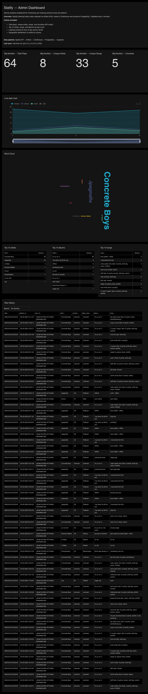

<div align="center">


# Statify

**Personal Spotify analytics platform — built to track, enrich, and visualize your listening history at scale.**

[](https://spotifystatistics-production.up.railway.app)
[](#)

</div>

---

## Overview

Statify is an end-to-end analytics platform that continuously ingests your Spotify listening history, enriches each track with geographic artist metadata, and surfaces insights across a web application and a native iOS companion app.

The data pipeline runs every **3 minutes**, pulling the latest 50 played tracks per user via the Spotify API, resolving artist origins through MusicBrainz, and distributing records across two purpose-built databases — **ClickHouse** for fast analytic queries and **SQL Server** for the web application layer.

---

## Architecture

```
Spotify API
    │
    ▼
Apache Airflow  ──────────────────────────  every 3 min
    ├── fetch_user      →  last 50 played tracks per user
    ├── enrich          →  artist country + city (MusicBrainz)
    ├── dedup           →  deduplication by played_at + user_id
    ├── load_clickhouse →  ClickHouse (analytics store)
    └── load_mssql      →  SQL Server (web app store)
                                    │
                                    ▼
                         ASP.NET Core Web App
                                    │
                                    ▼
                            iOS App (Swift)
```

---

## Repository Structure

```
Statify/
├── web/                 # ASP.NET Core (C#) — Razor Pages web application
├── data_component/      # Python — Apache Airflow DAG + custom Docker image
├── ios/                 # Swift — native iOS companion app
└── README.md
```

---

## Tech Stack

### Data & Infrastructure

| Layer | Technology |
|---|---|
| Orchestration | Apache Airflow (custom Docker image) |
| Analytics DB | ClickHouse |
| App DB | Microsoft SQL Server |
| Airflow metadata | PostgreSQL |
| Analytics UI | Apache Superset (custom Docker image) |
| Hosting | Railway |

> **Note:** Both Apache Airflow and Apache Superset are deployed using **custom Docker images** — not the official defaults. Each image is purpose-built for Railway's environment with pre-configured connections, environment injection, and production-hardened settings.

### Web Application

| Layer | Technology |
|---|---|
| Framework | ASP.NET Core 10 · Razor Pages |
| Language | C# |
| Auth | ASP.NET Identity · Google OAuth · GitHub OAuth · Spotify OAuth |
| ORM | Entity Framework Core |
| Frontend | Vanilla JS · Custom CSS |
| Maps | D3.js |
| Email | Resend API (`noreply@statify.one`) |

### iOS

| Layer | Technology |
|---|---|
| Language | Swift 6 |
| UI | SwiftUI |
| Charts | Swift Charts |
| Maps | MapKit |
| Networking | URLSession + async/await |
| Min target | iOS 17 |

---

## Features

### Web Application

| Page | Description |
|---|---|
| **Dashboard** | Top tracks, artists, albums · listening by hour · activity heatmap by month |
| **Recently Played** | Paginated full history with search and time range filter |
| **World Map** | D3.js visualization — artist origins plotted by country |
| **Settings** | Profile photo · email · password · linked accounts · GDPR data export |

### Admin Dashboard (Superset)

Internal analytics dashboard powered by **Apache Superset**, connected directly to ClickHouse. Provides platform-wide visibility into listening activity with the following charts:

- **KPI cards** — total plays, unique artists, unique songs, countries
- **Daily activity line chart** — streams, albums, and artists over time
- **Top 10 artists / albums / songs** — ranked by play count
- **Artist word cloud** — frequency-weighted visualization
- **Raw history table** — full unfiltered event log



---

## Design System

Consistent visual identity across web and iOS:

| Token | Value |
|---|---|
| Background | `#080808` |
| Card | `#111111` |
| Accent | `#1DB954` (Spotify green) |
| Text primary | `#FFFFFF` |
| Text secondary | `#999999` |
| Heading font | Syne |
| Body font | DM Sans |

---

## Roadmap

- [x] Airflow pipeline — fetch, enrich, deduplicate, load
- [x] ASP.NET Core web app with full Spotify OAuth
- [x] Dashboard · Recently Played · World Map
- [x] Full account management + GDPR export
- [x] Transactional email via Resend on `statify.one`
- [x] Custom domain with DNS + SSL
- [x] Admin analytics dashboard (Superset + ClickHouse)
- [x] iOS app — Phase 1: Auth + Dashboard
- [x] iOS app — Phase 2: Recently Played + World Map
- [x] iOS app — Phase 3: Settings + Polish

---

## Modules

- [`data_component/`](./data_component/README.md) — Airflow DAG, setup, and deployment
- [`web/`](./web/README.md) — ASP.NET Core web app, local setup, and Railway deployment
- [`ios/`](./ios/README.md) — Swift iOS app, architecture, and build plan

---

*Built to demonstrate end-to-end skills across data engineering, backend development, and full-stack system design.*
